## SOLUTECH Interview Solution

👀  Solution code for the habit tracker app for crossplatform using [flutter](https://flutter.dev/).
The final app looks like this:

#### Auth
| Sign up page                          | Sign in page                          | Reset password page                           | Google sign in page                          |
|---------------------------------------|---------------------------------------|-----------------------------------------------|----------------------------------------------|
| 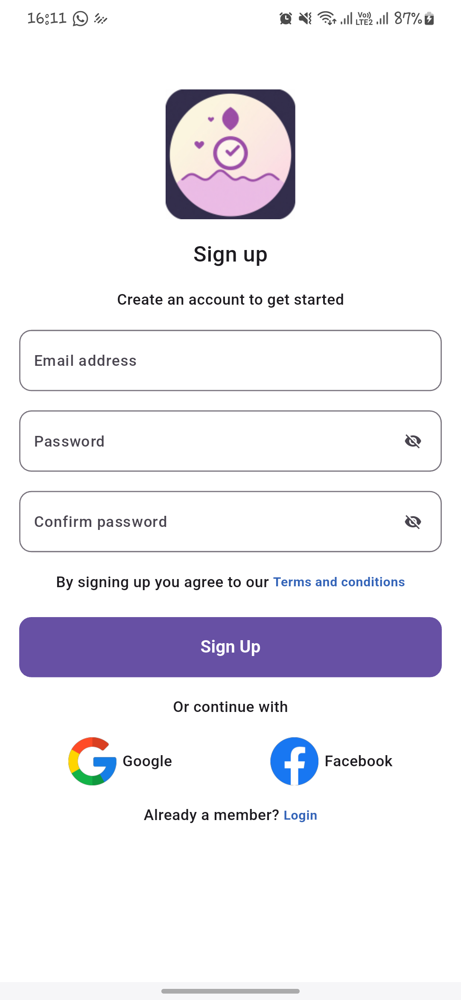 | 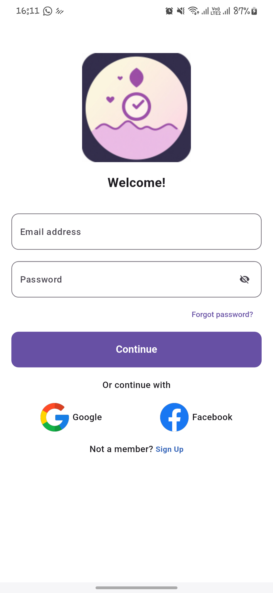 | 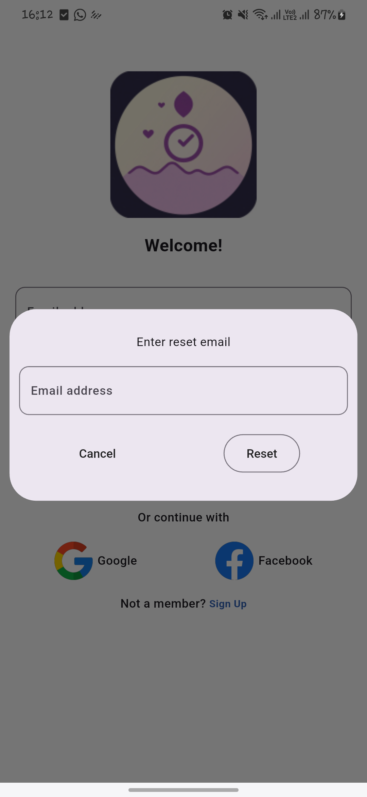 | 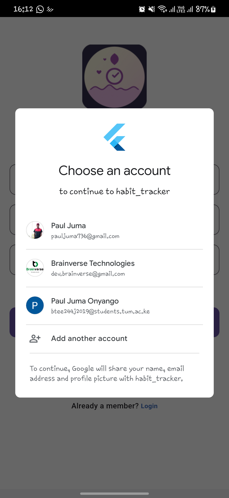 |

#### Home Screen
| Choose habit page                               | Home page                             | Add activity page                        |   |
|-------------------------------------------------|---------------------------------------|------------------------------------------|---|
| 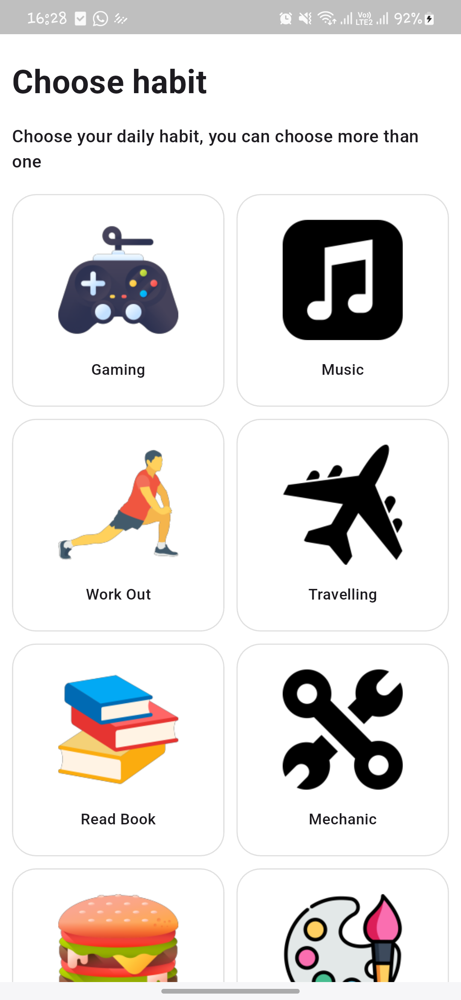 | 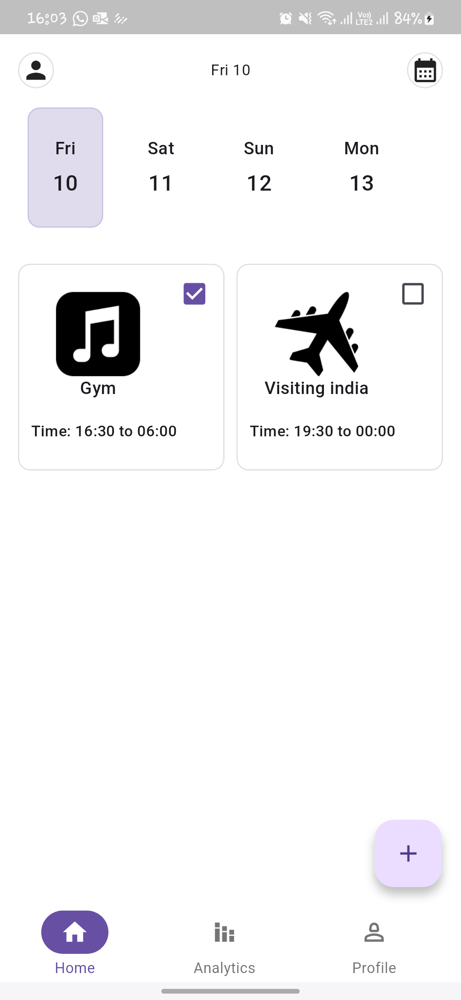 | 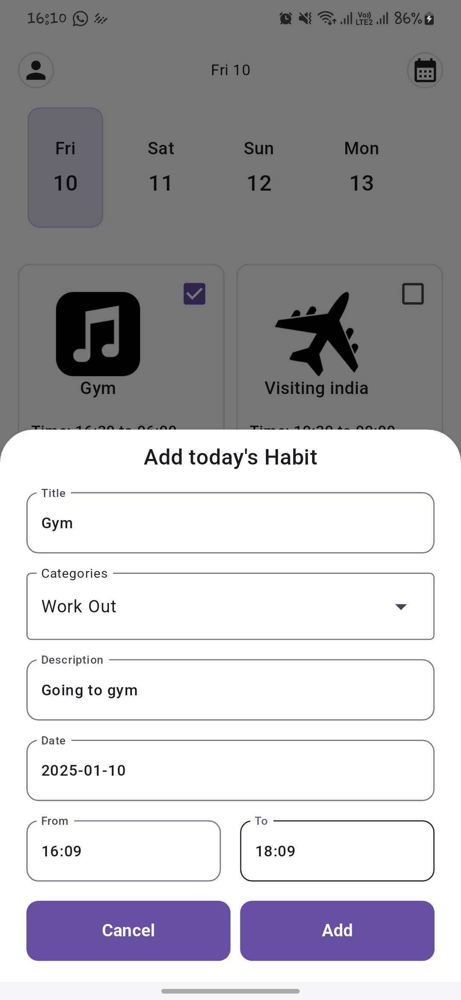 |

### Report Screen
| Daily report                                          | Weekly report                                           | Specific day activity                                  |  |
|-------------------------------------------------------|---------------------------------------------------------|--------------------------------------------------------|--|    
| 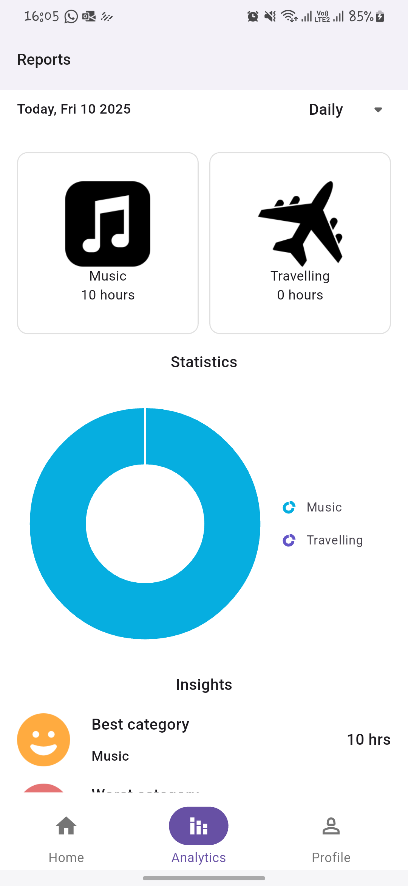 | 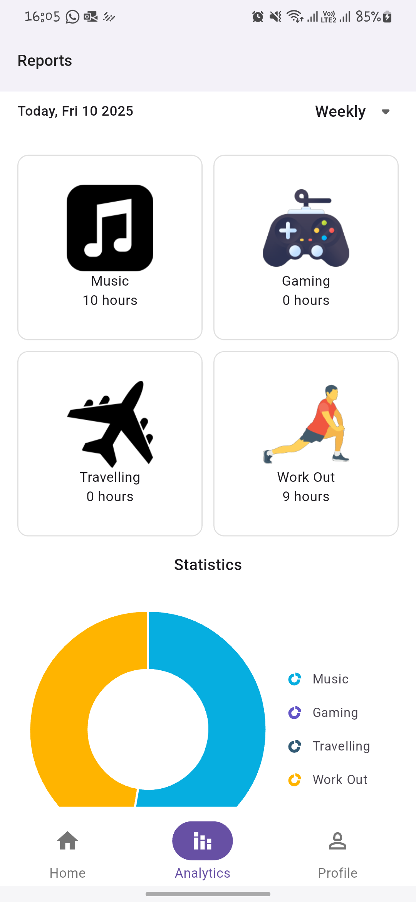 | 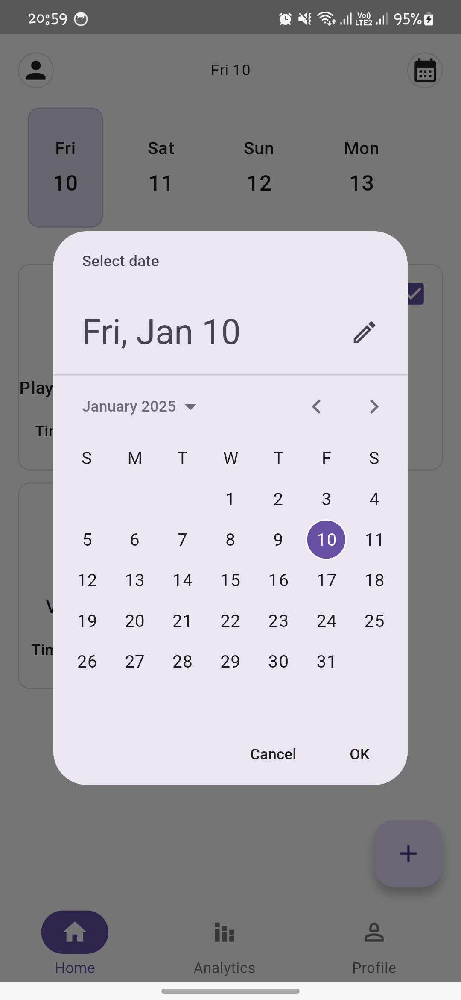 |  |

### Notification Screen

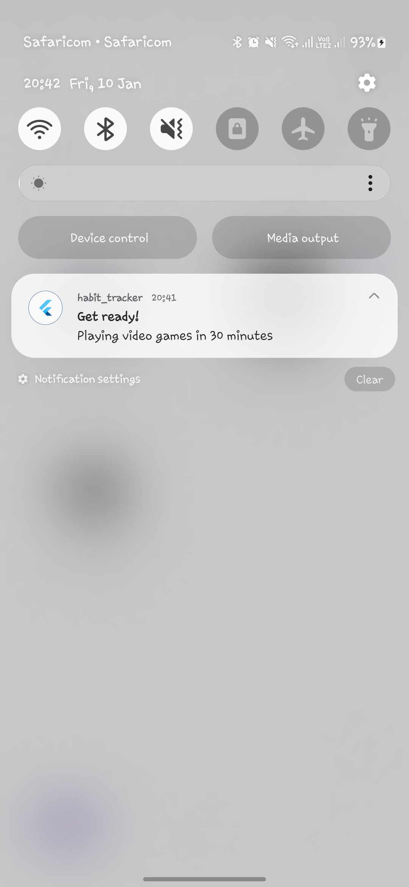


### Profile screen

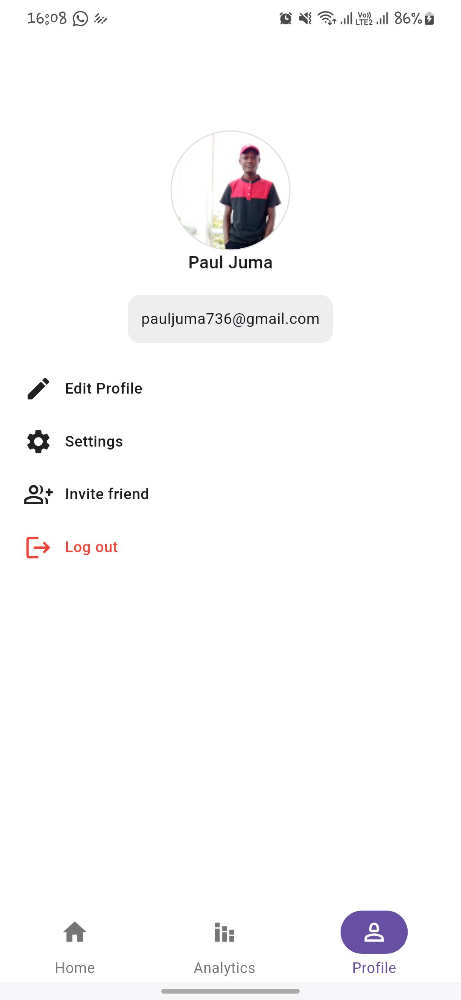


### Prerequisites

- Before running this app, you need to have java 19 installed:

- Ensure the minimum sdk set above 21 and multiDexEnabled set to true on app/build.gradle:

```shell script
    defaultConfig {
        minSdk = 23
        multiDexEnabled true
    }
```
- Ensure the compile sdk is set to 34:
```shell script
    android {
    compileSdk = 34
```
- Once the project is set up, run:
```shell script
    flutter pub get
```

### Background
Develop a Gamified Habit Tracker App in Flutter that works on both mobile(Android/iOS) and web.
- The project should demonstrate proficiency in Flutter development, responsive design, CI/CD pipelines, and modern development best practices.

#### Core features
##### 1. Authentification
-  implement both social auth and auth using password and email.

NB: In this project, only sign in with google is Implemented.

##### 2. Habit management
* Create Habits: Allow users to create habits with details such as name, description (optional), frequency (e.g., daily, weekly), and start date.
* Edit Habits: Enable users to update existing habits.
* Track and Visualize Progress

##### 3. Notifications and Reminders
* Provide reminders for pending habits using notifications.
* Allow users to set custom reminder times for individual habits.

##### 4. Gamification
* Stats to show how the user is fairing

##### 5. Offline-First Functionality
##### 6. Theming and Responsiveness


## Tech-stack

* Framework
  * [Flutter](https://flutter.dev/) - a cross-platform, statically typed, general-purpose programming language with type inference.

* State management
  * [Getx](https://chornthorn.github.io/getx-docs/) - For state management, navigation, and dependency injection.

* Backend Services:
  * [Firebase](https://console.firebase.google.com/u/0/) - Firebase auth, firebase appdistribution and Firebase firestore

* Tests
  * [Mockito]() - For mocking dependencies during unit tests.

* CI/CD
  * Github Actions

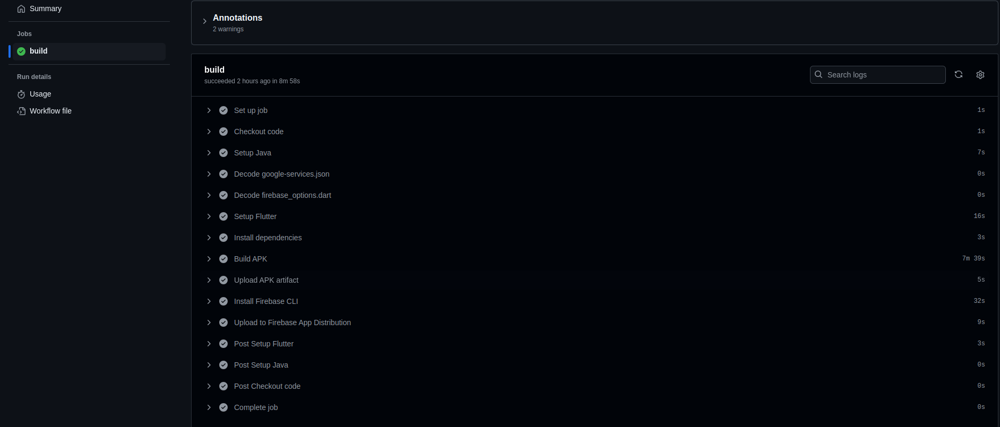


## Dependencies

All the dependencies (external libraries) are defined in the single place - pubspec.yaml.

## License
```
MIT License

Copyright (c) 2025 Juma Paul

Permission is hereby granted, free of charge, to any person obtaining a copy of this software and
associated documentation files (the "Software"), to deal in the Software without restriction, including
without limitation the rights to use, copy, modify, merge, publish, distribute, sublicense, and/or sell
copies of the Software, and to permit persons to whom the Software is furnished to do so, subject to
the following conditions:

The above copyright notice and this permission notice shall be included in all copies or substantial
portions of the Software.

THE SOFTWARE IS PROVIDED "AS IS", WITHOUT WARRANTY OF ANY KIND, EXPRESS OR IMPLIED, INCLUDING BUT NOT
LIMITED TO THE WARRANTIES OF MERCHANTABILITY, FITNESS FOR A PARTICULAR PURPOSE AND NONINFRINGEMENT. IN
NO EVENT SHALL THE AUTHORS OR COPYRIGHT HOLDERS BE LIABLE FOR ANY CLAIM, DAMAGES OR OTHER LIABILITY,
WHETHER IN AN ACTION OF  TORT OR OTHERWISE, ARISING FROM, OUT OF OR IN CONNECTION WITH THE
SOFTWARE OR THE USE OR OTHER DEALINGS IN THE SOFTWARE.
```
